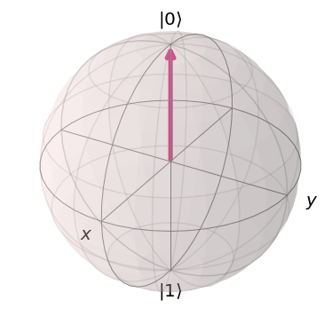

# Qubit Operations
### A Simple introduction to qubits with Qiskit

Steps taken:
* imports
* create qubit
    * through `QuantumCircuit()`
    * put in superposition
    * measure
* simulations
    * `qasm_simulator` to view measures through `shots` amount of iters
    * `statevector_simulator` to view measurement probabilty and single measurement of qubit
        * plot measurement to represent state on bloch sphere

Result:

